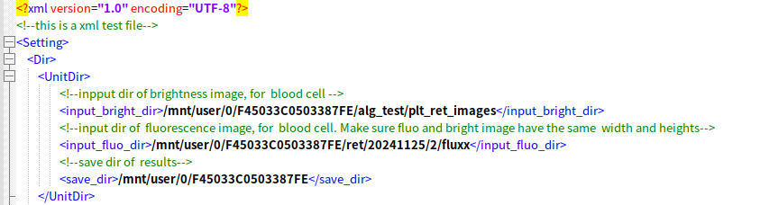
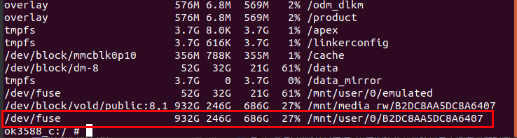
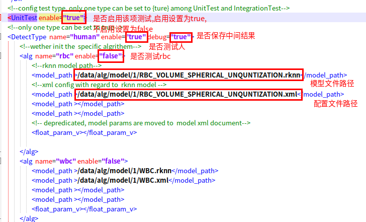
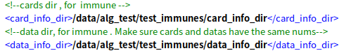
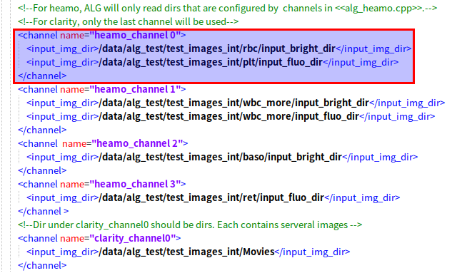
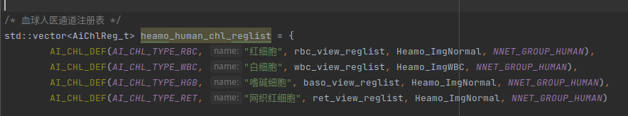
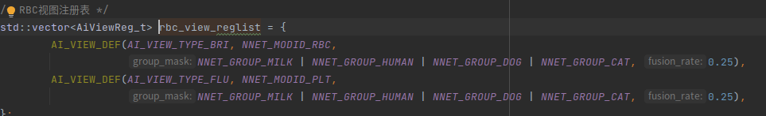
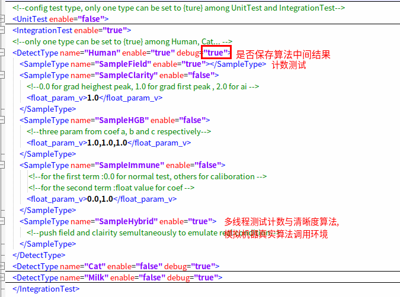
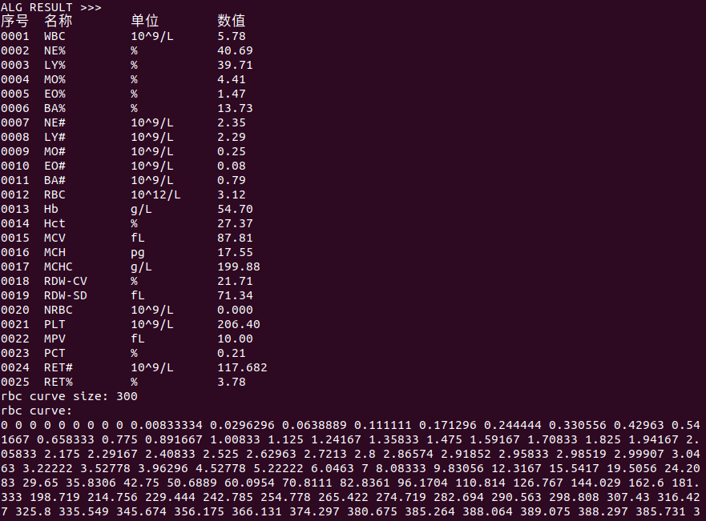

# 血球本地测试项目说明
该文档主要阐释了血球本地测试程序的使用方法

# 使用已编译程序
1.将程序,配置文件及运行脚本上传至
板上:```adb push app_local_test alg_config.xml  run.sh  /data/alg_test/2reconstruct```.其中```/data/alg_test/2reconstruct```
为上传目录,```adb push```为上传命令.  
2.将运行依赖文件上传至版上:```adb push ./app/* /data/alg_test/2reconstruct/data/alg```.其中```/data/alg```为DIH-500指定相对目录,为保持一致,
依赖文件需放在该目录结构下.  
3.确认上传是否成功,
打开命令行窗口,输入```adb root```切换为root模式,输入```adb shell```进入板子命令行窗口.输入```cd /data/alg_test/2reconstruct```及```ls```确认上传
文件是否存在,若上传成功,目录结构应当如下:
```
  2reconstruct  
  ├─ app_local_test  
  ├─ alg_config.xml  
  ├─ data  
     ├─ alg
        ├─ cl
        ├─ lib
        ├─ link_lib
        ├─ lua
        ├─ model
  ├─ run.sh 
```
# 测试
## UnitTest 单元测试
### UnitDir 配置单元测试数据目录.
  
将待测试数据上传至板子或板子可访问的硬盘上,并将上传数据的目录写入至xml文件的相应配置项中.图中```input_bright_dir```为明场图像目录,
```input_fluo_dir```为荧光场图像目录,```save_dir```为测试结果保存目录.测试结果将保存检测框的文本文档及绘制有检测结果的图像.
注:在测试白细胞4分类时,需要明场及荧光场目录下图像张数相同.  
此处以将数据拷贝至板可访问的硬盘上进行测试为例:  
若准备测试硬盘```/media/y/B2DC8AA5DC8A6407/alg_test/rbc_count/3```目录下的图像.  
1).将硬盘连接至板上  
2).进入板子命令行窗口,输入```df -h```,将显示板子分区信息:  
    
图中红色框内目录即为板上硬盘目录  
3).输入```cd /mnt/user/0/B2DC8AA5DC8A6407```进入硬盘目录.选择硬盘上待测试图像目录如:```/mnt/user/0/B2DC8AA5DC8A6407/alg_test/rbc_count/3```  
4).根据待测试图像目录的类型(明场,荧光场)写入xml文件的相应项中.如```/mnt/user/0/B2DC8AA5DC8A6407/alg_test/rbc_count/3```为明场图像,即将
该目录写入```input_bright_dir```项中.若其是荧光场图像,如plt,则写入```input_fluo_dir```项中.

### 配置测试模型及参数
  
模型参数文件,模型配置文件需上传至版上,并将其路径依次写入对应检测项,如```rbc```的```model_path```字段中.
模型配置文件的配置方式请参考```./app/model/1/RBC_VOLUME_SPHERICAL_UNQUNTIZATION.xml```

### 测试  
配置好alg_config.xml文件后,输入```adb push alg_config.xml /data/alg_test/2reconstruct```,
打开板子命令行窗口,进入上传的程序目录如```/data/alg_test/2reconstruct```,输入```./run.sh```即可得到运行结果.运行结果将保存在```save_dir```目录中.

## IntegrationTest 整体测试
### IntegrationDir 配置整体测试数据目录
1.免疫  
  
```card_info_dir```为免疫所需的试剂卡目录, ```data_info_dir```为免疫所需数据目录,两目录下文件个数需相同.即试剂卡信息与数据信息一一对应   
2.血球  
  

#### 简洁说明:
依照图示```input_img_dir```目录细胞类型,使用待测图像目录替换现有目录即可.例:  

若需要测试一组图中rbc流道各参数,将图像目录,如```./rbc_channel/bright```,```./rbc_channel/fluo```分别写入图中```/data/alg_test/test_images_int/rbc/input_bright_dir```,
```/data/alg_test/test_images_int/plt/input_fluo_dir```处即可.

对于同时存在明场,荧光场的流道,两个文件夹内的图像数量需相等.只有单个场的则不需要.

最后一个```chanenl```表示清晰度测试所需目录,该目录下需包含多个```文件夹```,每个文件下包含一组聚焦图像,目录如下:
```
  Movies  
  ├─  test1  
      ├─  1.bmp  
      ├─  2.bmp  
      ├─  jujiaox.bmp  
      ├─  ...  
  ├─  jujiao2  
  ├─  xx3  
  ├─  ...  
```
#### 详细说明(整体测试可跳过该章节,后续需要详细理解再进行查阅):
图中```channel```为血球相关数据目录.前8项为计数测试所需目录.目录所对应的图像类型应当与血球代码中```alg_heamo.cpp```流道配置一致.例:

  
通道代码中第一行表示第一个流道为红细胞,其对应的视图列表```rbc_view_reglist```中第一行为明场红细胞,第二张
为荧光场血小板,因此xml文件中的第一个channel表示第一个流道红细胞的图像配置,项中的第一个```input_img_dir```为红细胞图像目录,
第二个为血小板图像目录.  
此外当```channel```中配置超过代码视图表的```input_img_dir```目录时,多余的目录将不会生效.  

#### 配置项说明

#### 测试
配置好alg_config.xml文件后,输入```adb push alg_config.xml /data/alg_test/2reconstruct```,
打开板子命令行窗口,进入上传的程序目录如```/data/alg_test/2reconstruct```,输入```./run.sh```即可得到运行结果.运行结果将保存在```save_dir```目录中.

  
整体测试结果示例
# 使用源码编译
1.将```Makefile```文件中的```PROJECT_PATH```修改为当前项目目录.```COMPILE_PATH```修改为本地工具链路径,
```THIRD_PARTY_PATH```修改为三方库目录,二者在服务器```/home/y/ALG/lf/rknn_tools```目录下  
2.打开命令行窗口,输入```make -f Makefile```进行编译.编译完成后可参考```使用已编译程序```章节上传程序及运行环境


