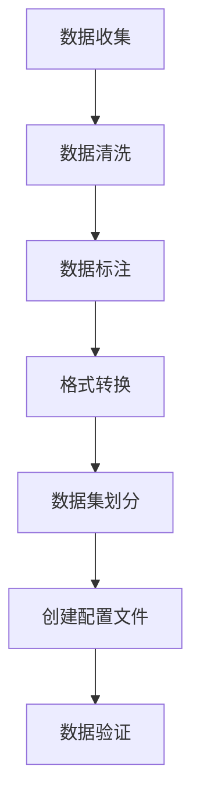

# YOLO 数据集准备指南 (Dataset Preparation Guide)

本指南详细介绍了如何为 YOLO 训练准备数据集，包括数据收集、标注、格式转换和验证。

## 数据集准备工作流



## 1. 数据收集策略 (Data Collection Strategy)

### 1.1 数据来源

| 来源 | 优点 | 缺点 | 用例 |
|--------|------------|---------------|-----------|
| **公开数据集** | 免费，高质量标注，多样性强 | 可能与目标场景不匹配 | 预训练、基准测试 |
| **网络爬取** | 数据量大，场景丰富 | 缺少标注，版权问题 | 数据增强 |
| **手动采集** | 场景相关性高，质量可控 | 成本高，耗时 | 专业垂直应用 |
| **合成数据** | 数据无限，标注完美 | 可能与真实数据存在差异 | 辅助训练 |

### 1.2 数据收集原则

1. **多样性**: 涵盖不同的光照、角度、尺度、背景
2. **代表性**: 准确反映实际应用场景
3. **平衡性**: 各类别数量相对均衡
4. **高质量**: 图像清晰，无模糊，无遮挡

### 1.3 推荐的公开数据集

| 数据集 | 任务 | 类别数 | 图像数 | 链接 |
|---------|------|---------|--------|------|
| **COCO** | 检测/分割 | 80 | 330K | [cocodataset.org](https://cocodataset.org) |
| **VOC** | 检测/分割 | 20 | 11.5K | [host.robots.ox.ac.uk](http://host.robots.ox.ac.uk/pascal/VOC/) |
| **Open Images** | 检测 | 600 | 1.9M | [storage.googleapis.com](https://storage.googleapis.com/openimages/web/index.html) |
| **ImageNet** | 分类 | 1000 | 1.4M | [image-net.org](https://www.image-net.org) |
| **MPII** | 姿态估计 | - | 25K | [human-pose.mpi-inf.mpg.de](http://human-pose.mpi-inf.mpg.de) |
| **Cityscapes** | 分割 | 30 | 25K | [cityscapes-dataset.com](https://www.cityscapes-dataset.com) |

## 2. 数据标注 (Data Annotation)

### 2.1 标注工具选择

| 工具 | 类型 | 优点 | 缺点 | 支持的格式 |
|------|------|------------|---------------|-------------------|
| **LabelImg** | 桌面应用 | 简单，直接支持 YOLO 格式 | 功能基础 | YOLO, PascalVOC |
| **CVAT** | Web 应用 | 功能强大，适合团队协作 | 需要部署 | COCO, YOLO, VOC 等 |
| **Roboflow** | 云服务 | 一站式解决方案 | 付费版本较贵 | 所有主流格式 |
| **Label Studio** | 开源平台 | 灵活，可扩展 | 配置复杂 | 自定义格式 |
| **Makesense.ai** | 在线工具 | 免费，免安装 | 依赖网络 | YOLO, COCO 等 |
| **VGG Image Annotator** | 在线工具 | 简单直接 | 功能有限 | CSV, JSON |

### 2.2 标注最佳实践

#### **边界框标注 (Bounding Box)**
- 紧密包围目标，但不要过于紧贴（留一点点边缘）
- 包含完整目标，避免截断
- 对于被遮挡的目标，只标注可见部分
- 保持边界框水平（除非使用 OBB 任务）

#### **类别标注 (Class)**
- 使用一致的类别名称
- 建立清晰的类别层级
- 标注所有可见目标，避免漏标
- 对于困难样本，使用 "difficult" 标记

#### **分割标注 (Segmentation)**
- 沿目标轮廓精确标注
- 对复杂形状使用多边形
- 确保分割掩码连续且无孔洞
- 正确处理重叠区域

### 2.3 LabelImg 使用示例

```bash
# 安装 LabelImg
pip install labelImg

# 启动标注工具
labelImg

# 或指定图像目录启动
labelImg [image_directory] [predefined_classes_file]
```

标注工作流:
1. 打开图像目录
2. 设置输出目录 (推荐设为 `labels/`)
3. 选择 YOLO 格式
4. 创建/加载类别文件
5. 标注目标并保存

## 3. 数据格式转换 (Data Format Conversion)

### 3.1 YOLO 格式详解

#### **目录结构**
```
my_dataset/
├── data.yaml            # 数据集配置文件
├── images/
│   ├── train/           # 训练图像
│   │   ├── img1.jpg
│   │   └── img2.jpg
│   └── val/             # 验证图像
│       ├── img3.jpg
│       └── img4.jpg
└── labels/
    ├── train/           # 训练标签
    │   ├── img1.txt
    │   └── img2.txt
    └── val/             # 验证标签
        ├── img3.txt
        └── img4.txt
```

#### **标签文件格式**
每个标签文件对应一张图像，每行一个目标：
```
<类别ID> <中心x> <中心y> <宽度> <高度>
```

`img1.txt` 示例:
```
0 0.512 0.613 0.156 0.311
2 0.789 0.422 0.123 0.245
0 0.345 0.256 0.067 0.189
```

坐标计算公式:
```python
中心x = (x_min + x_max) / 2 / 图像宽度
中心y = (y_min + y_max) / 2 / 图像高度
宽度 = (x_max - x_min) / 图像宽度
高度 = (y_max - y_min) / 图像高度
```

### 3.2 格式转换脚本

#### **COCO 转 YOLO**
```python
import json
from pathlib import Path

def coco_to_yolo(coco_json_path, output_dir):
    """将 COCO 格式转换为 YOLO 格式"""
    
    # 加载 COCO 标注
    with open(coco_json_path, 'r') as f:
        coco_data = json.load(f)
    
    # 创建输出目录
    images_dir = Path(output_dir) / 'images'
    labels_dir = Path(output_dir) / 'labels'
    images_dir.mkdir(parents=True, exist_ok=True)
    labels_dir.mkdir(parents=True, exist_ok=True)
    
    # 将类别 ID 映射到 YOLO 类别索引
    categories = {cat['id']: idx for idx, cat in enumerate(coco_data['categories'])}
    
    # 处理每张图片
    for img_info in coco_data['images']:
        img_id = img_info['id']
        img_width = img_info['width']
        img_height = img_info['height']
        img_name = img_info['file_name']
        
        # 找到该图像的标注
        img_annotations = [ann for ann in coco_data['annotations'] if ann['image_id'] == img_id]
        
        # 创建标签文件
        label_file = labels_dir / f"{Path(img_name).stem}.txt"
        with open(label_file, 'w') as f:
            for ann in img_annotations:
                # 获取 COCO 格式的边界框 [x_min, y_min, width, height]
                bbox = ann['bbox']
                x_min, y_min, width, height = bbox
                
                # 转换为 YOLO 格式
                x_center = (x_min + width / 2) / img_width
                y_center = (y_min + height / 2) / img_height
                width_norm = width / img_width
                height_norm = height / img_height
                
                # 获取类别 ID
                class_id = categories.get(ann['category_id'], 0)
                
                # 写入文件
                f.write(f"{class_id} {x_center:.6f} {y_center:.6f} {width_norm:.6f} {height_norm:.6f}\n")
    
    print(f"转换完成。输出目录: {output_dir}")
```

#### **VOC 转 YOLO**
```python
import xml.etree.ElementTree as ET
from pathlib import Path

def voc_to_yolo(voc_xml_path, output_dir, class_mapping):
    """将 VOC XML 格式转换为 YOLO 格式"""
    
    # 解析 XML
    tree = ET.parse(voc_xml_path)
    root = tree.getroot()
    
    # 获取图像尺寸
    size = root.find('size')
    img_width = int(size.find('width').text)
    img_height = int(size.find('height').text)
    
    # 创建输出文件
    output_file = Path(output_dir) / f"{Path(voc_xml_path).stem}.txt"
    
    with open(output_file, 'w') as f:
        # 处理每个目标
        for obj in root.findall('object'):
            # 获取类别名称
            class_name = obj.find('name').text
            class_id = class_mapping.get(class_name, 0)
            
            # 获取边界框
            bndbox = obj.find('bndbox')
            x_min = float(bndbox.find('xmin').text)
            y_min = float(bndbox.find('ymin').text)
            x_max = float(bndbox.find('xmax').text)
            y_max = float(bndbox.find('ymax').text)
            
            # 转换为 YOLO 格式
            x_center = (x_min + x_max) / 2 / img_width
            y_center = (y_min + y_max) / 2 / img_height
            width = (x_max - x_min) / img_width
            height = (y_max - y_min) / img_height
            
            # 写入文件
            f.write(f"{class_id} {x_center:.6f} {y_center:.6f} {width:.6f} {height:.6f}\n")
```

## 4. 数据集配置 (Dataset Configuration)

### 4.1 YAML 配置文件

在您的数据集目录中创建 `data.yaml`：

```yaml
# YOLO 训练的数据集配置

# 路径 (相对于此文件或绝对路径)
path: /path/to/your/dataset  # 数据集根目录
train: images/train  # 训练图像目录 (相对于 'path')
val: images/val      # 验证图像目录 (相对于 'path')
test: images/test    # 测试图像目录 (可选, 相对于 'path')

# 类别信息
names:
  0: person
  1: bicycle
  2: car
  3: motorcycle
  4: airplane
  5: bus
  6: train
  7: truck
  8: boat
  9: traffic light
  # ... 添加所有其他类别

# 可选参数
nc: 80               # 类别总数
roboflow:
  workspace: your-workspace
  project: your-project
  version: 1
  license: CC BY 4.0
  url: https://universe.roboflow.com/...
```

### 4.2 数据集划分

```python
from sklearn.model_selection import train_test_split
import shutil
from pathlib import Path

def split_dataset(image_dir, label_dir, output_dir, train_ratio=0.7, val_ratio=0.2, test_ratio=0.1):
    """将数据集划分为训练集/验证集/测试集"""
    
    # 获取所有图像文件
    image_files = list(Path(image_dir).glob('*.jpg')) + list(Path(image_dir).glob('*.png'))
    
    # 划分索引
    train_files, temp_files = train_test_split(image_files, train_size=train_ratio, random_state=42)
    val_files, test_files = train_test_split(temp_files, train_size=val_ratio/(val_ratio+test_ratio), random_state=42)
    
    # 创建输出目录
    splits = {
        'train': train_files,
        'val': val_files,
        'test': test_files
    }
    
    for split_name, files in splits.items():
        # 创建目录
        img_split_dir = Path(output_dir) / 'images' / split_name
        label_split_dir = Path(output_dir) / 'labels' / split_name
        img_split_dir.mkdir(parents=True, exist_ok=True)
        label_split_dir.mkdir(parents=True, exist_ok=True)
        
        # 复制文件
        for img_file in files:
            # 复制图像
            shutil.copy(img_file, img_split_dir / img_file.name)
            
            # 复制对应的标签
            label_file = Path(label_dir) / f"{img_file.stem}.txt"
            if label_file.exists():
                shutil.copy(label_file, label_split_dir / label_file.name)
    
    print(f"数据集划分完成: {len(train_files)} 训练集, {len(val_files)} 验证集, {len(test_files)} 测试集")
```

## 5. 数据增强 (Data Augmentation)

### 5.1 YOLO 内置数据增强

YOLO 在训练期间提供内置的数据增强功能。可在训练命令中配置：

```python
from ultralytics import YOLO

model = YOLO('yolo26n.pt')

# 使用数据增强进行训练
model.train(
    data='dataset.yaml',
    epochs=100,
    imgsz=640,
    # 数据增强参数
    hsv_h=0.015,  # HSV-色调增强 (比例)
    hsv_s=0.7,    # HSV-饱和度增强 (比例)
    hsv_v=0.4,    # HSV-明度增强 (比例)
    degrees=0.0,  # 图像旋转 (+/- 角度)
    translate=0.1,  # 图像平移 (+/- 比例)
    scale=0.5,    # 图像缩放 (+/- 增益)
    shear=0.0,    # 图像剪切 (+/- 角度)
    perspective=0.0,  # 图像透视 (+/- 比例)
    flipud=0.0,   # 图像上下翻转 (概率)
    fliplr=0.5,   # 图像左右翻转 (概率)
    mosaic=1.0,   # 马赛克增强 (概率)
    mixup=0.0,    # Mixup 增强 (概率)
    copy_paste=0.0,  # 实例复制粘贴 (概率)
)
```

### 5.2 自定义数据增强流水线

```python
import albumentations as A
from albumentations.pytorch import ToTensorV2

def get_augmentations(mode='train'):
    """获取用于训练或验证的数据增强流水线"""
    
    if mode == 'train':
        return A.Compose([
            A.Resize(640, 640),
            A.HorizontalFlip(p=0.5),
            A.VerticalFlip(p=0.1),
            A.RandomBrightnessContrast(p=0.2),
            A.RandomGamma(p=0.2),
            A.HueSaturationValue(p=0.3),
            A.Rotate(limit=15, p=0.5),
            A.Blur(blur_limit=3, p=0.1),
            A.CLAHE(p=0.1),
            A.ToGray(p=0.1),
            ToTensorV2()
        ], bbox_params=A.BboxParams(format='yolo', label_fields=['class_labels']))
    
    else:  # 验证/测试
        return A.Compose([
            A.Resize(640, 640),
            ToTensorV2()
        ], bbox_params=A.BboxParams(format='yolo', label_fields=['class_labels']))
```

## 6. 数据验证 (Data Validation)

### 6.1 数据集统计

```python
from collections import Counter
from pathlib import Path
import matplotlib.pyplot as plt

def analyze_dataset(labels_dir):
    """分析数据集统计信息"""
    
    label_files = list(Path(labels_dir).glob('*.txt'))
    
    # 统计每个类别的目标数量
    class_counts = Counter()
    bbox_stats = {'widths': [], 'heights': []}
    
    for label_file in label_files:
        with open(label_file, 'r') as f:
            for line in f:
                parts = line.strip().split()
                if len(parts) >= 5:
                    class_id = int(parts[0])
                    class_counts[class_id] += 1
                    
                    # 边界框尺寸
                    width = float(parts[3])
                    height = float(parts[4])
                    bbox_stats['widths'].append(width)
                    bbox_stats['heights'].append(height)
    
    # 打印统计信息
    print(f"标签文件总数: {len(label_files)}")
    print(f"目标总数: {sum(class_counts.values())}")
    print("\n类别分布:")
    for class_id, count in sorted(class_counts.items()):
        print(f"  类别 {class_id}: {count} 个目标 ({count/sum(class_counts.values())*100:.1f}%)")
    
    # 绘制分布图
    plt.figure(figsize=(10, 5))
    plt.subplot(1, 2, 1)
    plt.hist(bbox_stats['widths'], bins=50, alpha=0.7)
    plt.title('边界框宽度分布')
    plt.xlabel('归一化宽度')
    
    plt.subplot(1, 2, 2)
    plt.hist(bbox_stats['heights'], bins=50, alpha=0.7)
    plt.title('边界框高度分布')
    plt.xlabel('归一化高度')
    
    plt.tight_layout()
    plt.show()
```

### 6.2 常见问题与修复方法

| 问题 | 症状 | 解决方案 |
|-------|----------|----------|
| **类别不平衡** | 罕见类别表现差 | 数据增强、类别权重调整、过采样 |
| **错误标注** | 训练损失高，验证集表现差 | 人工审核、使用自动化验证脚本 |
| **格式错误** | 无法开始训练 | 验证 YOLO 格式，检查坐标是否在 [0, 1] 范围内 |
| **漏标** | 模型无法检测出目标 | 确保所有目标都被标注 |
| **命名不一致** | 类别映射错误 | 在 data.yaml 中标准化类别名称 |

## 7. 质量保证检查清单 (QA Checklist)

- [ ] 所有图像格式正确 (JPEG, PNG)
- [ ] 图像尺寸一致或已正确调整大小
- [ ] 所有感兴趣的目标都已标注
- [ ] 边界框紧密且准确
- [ ] 整个数据集的类别标签保持一致
- [ ] 数据集已正确划分 (训练集/验证集/测试集)
- [ ] `data.yaml` 文件配置正确
- [ ] 类别分布平衡或已采取处理措施
- [ ] 不同划分集中没有重复的图像
- [ ] 已分析数据集统计信息

## 8. 下一步

数据集准备好之后：
1. **验证 (Verify)**：使用 `analyze_dataset()` 函数
2. **测试 (Test)**：进行一次小规模的训练测试
3. **优化 (Optimize)**：调整数据增强参数
4. **记录 (Document)**：记录数据集特征
5. **备份 (Backup)**：备份准备好的数据集

## 相关文档

- [训练基础](./training_basics.md) - YOLO 模型训练指南
- [模型选择](./model_selection.md) - 选择合适的模型
- [Ultralytics 数据集指南](https://docs.ultralytics.com/datasets/) - 官方数据集文档
- [Roboflow](https://roboflow.com) - 数据集管理和数据增强平台

## 实用脚本

如需使用现成的数据集准备工具，请使用 `dataset_tools.py` 脚本：

```bash
# 运行数据集工具示例
python scripts/dataset_tools.py

# 在代码中导入
from scripts.dataset_tools import (
    coco_to_yolo,          # 将 COCO 转换为 YOLO 格式
    voc_to_yolo,           # 将 VOC 转换为 YOLO 格式
    split_dataset,         # 划分训练集/验证集/测试集
    analyze_dataset,       # 分析数据集统计信息
    create_data_yaml,      # 创建数据集配置
    validate_dataset,      # 验证数据集结构
    get_augmentation_pipeline  # 获取数据增强流水线
)

# 使用示例
coco_to_yolo('annotations.json', 'yolo_dataset')
stats = analyze_dataset('dataset/labels/train')
config_path = create_data_yaml('dataset', ['person', 'car', 'bicycle'])
```

**脚本位置**: `scripts/dataset_tools.py`

**优势**:
- 通过提取文档中的大型代码块来节省 tokens
- 提供开箱即用的函数，无需复制粘贴
- 模块化设计，只需导入需要的部分
- 包含一致的错误处理和日志记录
