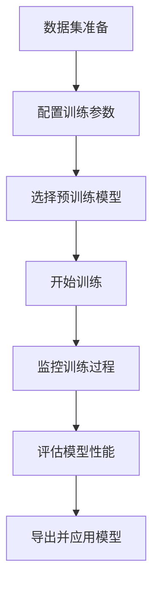

# YOLO 模型训练指南 (Model Training Guide)

本指南提供了使用 Ultralytics YOLO 训练模型的完整工作流程，涵盖了数据集准备、训练配置、执行监控以及结果评估。

## 训练概览 (Training Overview)

YOLO 训练是指微调预训练模型或使用自定义数据集从头开始训练新模型的过程。Ultralytics YOLO 提供了简单而强大的训练接口，支持多种视觉任务：

- **目标检测** (detect): 训练检测模型
- **实例分割** (segment): 训练分割模型
- **图像分类** (classify): 训练分类模型
- **姿态估计** (pose): 训练姿态估计模型
- **定向边界框检测** (obb): 训练定向检测模型

## 训练工作流概览

完整的训练工作流包括以下步骤：



## 1. 数据集准备 (Dataset Preparation)

### 1.1 数据集格式

Ultralytics YOLO 支持多种数据集格式：

#### **YOLO 格式 (推荐)**
```
dataset/
├── images/
│   ├── train/
│   │   ├── image1.jpg
│   │   └── image2.jpg
│   └── val/
│       ├── image3.jpg
│       └── image4.jpg
└── labels/
    ├── train/
    │   ├── image1.txt
    │   └── image2.txt
    └── val/
        ├── image3.txt
        └── image4.txt
```

标签文件格式 (每行代表一个物体):
```
<类别ID> <中心_x> <中心_y> <宽度> <高度>
```
- 坐标必须归一化到 [0, 1] 范围内
- `<类别ID>` 从 0 开始

#### **COCO 格式**
支持 COCO 风格的 JSON 标注文件，包含 `images`, `annotations`, `categories` 字段。

#### **其他格式**
- **VOC**: 支持 XML 标注
- **AutoDL**: 支持自动下载数据集

### 1.2 数据配置文件 (data.yaml)

训练前需创建一个数据集配置文件 `data.yaml`：

```yaml
# data.yaml 示例
path: /path/to/dataset  # 数据集根目录
train: images/train     # 训练图像路径 (相对于 path)
val: images/val         # 验证图像路径 (相对于 path)
test: images/test       # 测试图像路径 (可选)

# 类别定义
names:
  0: person
  1: bicycle
  2: car
  3: motorcycle
  4: airplane
  5: bus
  6: train
  7: truck
  8: boat
  9: traffic light

# 类别总数
nc: 10

# 下载链接 (可选，用于自动下载数据集)
download: https://ultralytics.com/assets/coco8.zip
```

## 2. 训练配置 (Training Configuration)

### 2.1 基础训练参数

```python
from ultralytics import YOLO

# 加载模型
model = YOLO('yolo26n.pt')  # 用于微调的预训练模型
# 或者 model = YOLO('yolo26n.yaml')  # 从头开始训练

# 基础训练配置
model.train(
    data='dataset.yaml',    # 数据集配置文件
    epochs=100,             # 训练轮数
    imgsz=640,              # 输入图像尺寸
    batch=16,               # 批次大小
    device='cuda:0',        # 训练设备
    workers=8,              # 数据加载线程数
    project='runs/train',   # 项目目录
    name='exp1',            # 实验名称
    exist_ok=True,          # 是否覆盖现有目录
    resume=False,           # 是否从上一个断点恢复
)
```

### 2.2 高级训练参数

```python
# 高级训练配置
model.train(
    data='dataset.yaml',
    epochs=100,
    imgsz=640,
    
    # 优化器参数
    lr0=0.01,               # 初始学习率
    lrf=0.01,               # 最终学习率系数
    momentum=0.937,         # SGD 动量
    weight_decay=0.0005,    # 优化器权重衰减
    warmup_epochs=3.0,      # 预热轮数
    warmup_momentum=0.8,    # 预热动量
    warmup_bias_lr=0.1,     # 预热偏置学习率
    
    # 数据增强参数
    hsv_h=0.015,            # HSV-色调增强
    hsv_s=0.7,              # HSV-饱和度增强
    hsv_v=0.4,              # HSV-明度增强
    degrees=0.0,            # 图像旋转
    translate=0.1,          # 图像平移
    scale=0.5,              # 图像缩放
    shear=0.0,              # 图像剪切
    perspective=0.0,        # 图像透视
    flipud=0.0,             # 上下翻转概率
    fliplr=0.5,             # 左右翻转概率
    mosaic=1.0,             # 马赛克增强概率
    mixup=0.0,              # Mixup 增强概率
    copy_paste=0.0,         # Copy-paste 增强概率
    
    # 模型参数
    pretrained=True,        # 使用预训练权重
    optimizer='auto',       # 优化器: SGD, Adam, AdamW 等
    verbose=True,           # 详细输出
    seed=0,                 # 随机种子
    deterministic=True,     # 确定性训练
    single_cls=False,       # 作为单类数据集训练
    rect=False,             # 矩形训练
    cos_lr=False,           # 余弦退火学习率调度器
    label_smoothing=0.0,    # 标签平滑
    dropout=0.0,            # Dropout 正则化
)
```

## 3. 选择训练模型

### 3.1 从预训练模型开始

```python
# 微调预训练模型 (大多数情况下的推荐做法)
model = YOLO('yolo26n.pt')      # Nano - 最快，最小
model = YOLO('yolo26s.pt')      # Small - 性能平衡
model = YOLO('yolo26m.pt')      # Medium - 多数应用的默认选择
model = YOLO('yolo26l.pt')      # Large - 精度更高
model = YOLO('yolo26x.pt')      # XLarge - 精度最高

# 特定任务模型
model = YOLO('yolo26n-seg.pt')  # 分割
model = YOLO('yolo26n-cls.pt')  # 分类
model = YOLO('yolo26n-pose.pt') # 姿态估计
model = YOLO('yolo26n-obb.pt')  # 定向检测
```

### 3.2 从头开始训练

```python
# 从头开始训练 (需要庞大的数据集)
model = YOLO('yolo26n.yaml')    # 架构定义
model.train(
    data='dataset.yaml',
    epochs=300,                  # 从头训练需要更多轮数
    pretrained=False,            # 不使用预训练权重
    lr0=0.1,                     # 更高的初始学习率
)
```

## 4. 执行训练 (Training Execution)

### 4.1 启动训练

```bash
# Python 接口
python train.py

# CLI 命令行接口
yolo detect train data=dataset.yaml model=yolo26n.pt epochs=100 imgsz=640
```

### 4.2 监控训练进度

YOLO 提供多种方式来监控训练：

1. **控制台输出**: 实时显示评估指标
2. **TensorBoard**: `tensorboard --logdir runs/train`
3. **Weights & Biases**: 安装后自动集成
4. **ClearML**: 安装后自动集成
5. **MLflow**: 安装后自动集成

### 4.3 训练输出结构

```
runs/train/exp/
├── args.yaml                # 训练参数
├── results.csv              # 训练指标 CSV 数据
├── results.png              # 训练指标曲线图
├── confusion_matrix.png     # 混淆矩阵
├── confusion_matrix_normalized.png
├── labels.jpg               # 训练标签可视化
├── labels_correlogram.jpg   # 标签相关图
├── train_batch0.jpg         # 训练批次示例
├── val_batch0_labels.jpg    # 验证集标签
├── val_batch0_pred.jpg      # 验证集预测结果
├── F1_curve.png             # F1-置信度曲线
├── P_curve.png              # 精确率-置信度曲线
├── R_curve.png              # 召回率-置信度曲线
├── PR_curve.png             # P-R 曲线
├── weights/
│   ├── best.pt              # 最佳模型权重
│   └── last.pt              # 最后一个 epoch 的模型权重
└── events.out.tfevents...   # TensorBoard 日志
```

## 5. 训练评估 (Training Evaluation)

### 5.1 评估指标

训练期间需要监控的关键指标：

- **mAP@0.5**: IoU=0.5 时的平均精度均值
- **mAP@0.5:0.95**: IoU 阈值从 0.5 到 0.95 的 mAP
- **Precision (精确率)**: 真正例 / (真正例 + 假正例)
- **Recall (召回率)**: 真正例 / (真正例 + 假负例)
- **F1 Score**: 精确率和召回率的调和平均数
- **Loss (损失)**: 总训练损失 (包含 box, class, dfl 损失)

### 5.2 训练期间验证

```python
# 配置训练期间的验证
model.train(
    data='dataset.yaml',
    epochs=100,
    val=True,                # 启用验证 (默认开启)
    save_period=-1,          # 每 N 轮保存一次权重 (-1 = 仅保存最后的)
    save_json=False,         # 将结果保存到 JSON
    save_hybrid=False,       # 保存标签的混合版本
    conf=0.001,              # 验证的置信度阈值
    iou=0.6,                 # 验证的 IoU 阈值
    max_det=300,             # 每张图像的最大检测数
    half=True,               # 验证时使用半精度
    dnn=False,               # 使用 OpenCV DNN 进行 ONNX 推理
    plots=True,              # 训练期间保存图表
)
```

### 5.3 手动模型评估

```python
# 评估已训练的模型
model = YOLO('runs/train/exp/weights/best.pt')

# 在验证集上评估
metrics = model.val(
    data='dataset.yaml',
    imgsz=640,
    batch=32,
    conf=0.001,
    iou=0.6,
    device='cuda:0',
    half=True,
    dnn=False,
    plots=True,
    save_json=True,
    save_hybrid=False,
)

print(f"mAP@0.5: {metrics.box.map50}")
print(f"mAP@0.5:0.95: {metrics.box.map}")
print(f"精确率: {metrics.box.p}")
print(f"召回率: {metrics.box.r}")
```

## 6. 超参数调优 (Hyperparameter Tuning)

### 6.1 学习率调优

```python
# 寻找最佳学习率
model = YOLO('yolo26n.pt')
model.tune(
    data='dataset.yaml',
    epochs=30,
    iterations=300,
    optimizer='AdamW',
    plots=True,
    save=True,
    val=True,
)
```

### 6.2 超参数进化 (Evolution)

```python
# 进化超参数
model = YOLO('yolo26n.pt')
model.train(
    data='dataset.yaml',
    epochs=100,
    evolve=True,            # 启用超参数进化
    evolve_population=300,  # 种群大小
    evolve_generations=10,  # 进化代数
    evolve_mutation=0.1,    # 突变率
    evolve_crossover=0.5,   # 交叉率
    evolve_elite=0.1,       # 精英比例
)
```

## 7. 常见训练问题与解决方案

| 问题 | 症状 | 解决方案 |
|-------|----------|----------|
| **CUDA 报错难以排查** | "RuntimeError: CUDA error: device-side assert triggered" 或 "shape 不一致" 报错 | **实战经验**: 在脚本开头添加 `import os; os.environ['CUDA_LAUNCH_BLOCKING'] = '1'`，强制同步执行以准确定位报错代码行。 |
| **过拟合 (Overfitting)** | 训练集精度高，验证集精度低 | 增加 dropout，添加正则化，使用更多数据增强 |
| **欠拟合 (Underfitting)** | 训练集和验证集性能都很差 | 增加模型容量，增加训练轮数，减少正则化 |
| **梯度消失 (Vanishing)** | 训练损失不下降 | 使用预训练模型，调整学习率，使用批量归一化 |
| **梯度爆炸 (Exploding)** | 训练损失变为 NaN | 梯度裁剪，降低学习率，减小批次大小 |
| **类别不平衡 (Imbalance)** | 罕见类别表现差 | 类别权重，过采样，使用 focal loss |
| **内存问题 (OOM)** | CUDA 内存不足错误 | 减小 batch size，减小图像尺寸，使用梯度累加 |

## 8. 最佳实践 (Best Practices)

### 8.1 训练检查清单

- [ ] 数据集已正确准备并经过验证
- [ ] 类别分布平衡或已处理
- [ ] 数据增强已适当配置
- [ ] 学习率调度器已设置
- [ ] 模型架构符合任务需求
- [ ] 硬件资源充足
- [ ] 使用适当的工具监控训练
- [ ] 保存了定期检查点 (Checkpoints)
- [ ] 跟踪了验证指标
- [ ] 监控并防止过拟合

### 8.2 性能优化提示

1. **使用混合精度**: GPU 训练时启用 `half=True` (速度提升 2 倍)
2. **Batch Size 调优**: 使用能放入 GPU 显存的最大 batch size
3. **数据加载优化**: 将 `workers` 设置为 CPU 核心数的 4-8 倍
4. **梯度累加 (Gradient Accumulation)**: 用累加模拟更大的 batch size
5. **模型剪枝 (Model Pruning)**: 移除不必要的层以提升推理速度

## 9. 模型导出与部署 (Export and Deployment)

### 9.1 导出格式

```python
# 将训练好的模型导出为各种格式
model = YOLO('runs/train/exp/weights/best.pt')

# 导出选项
model.export(format='torchscript')  # TorchScript
model.export(format='onnx')         # ONNX
model.export(format='openvino')     # OpenVINO
model.export(format='tensorrt')     # TensorRT
model.export(format='coreml')       # CoreML
model.export(format='saved_model')  # TensorFlow SavedModel
model.export(format='pb')           # TensorFlow GraphDef
model.export(format='tflite')       # TensorFlow Lite
model.export(format='paddle')       # PaddlePaddle
model.export(format='ncnn')         # NCNN
```

### 9.2 部署示例

```python
# 部署导出的模型
import torch

# 加载 TorchScript 模型
model = torch.jit.load('yolo26n.torchscript')

# 加载 ONNX 模型
import onnxruntime
session = onnxruntime.InferenceSession('yolo26n.onnx')

# 加载 TensorRT 模型
import tensorrt as trt
with open('yolo26n.engine', 'rb') as f:
    runtime = trt.Runtime(trt.Logger(trt.Logger.WARNING))
    engine = runtime.deserialize_cuda_engine(f.read())
```

## 10. 下一步

训练完成后：

1. **评估 (Evaluate)** 模型在测试集上的表现
2. **分析 (Analyze)** 错误案例和混淆矩阵
3. **优化 (Optimize)** 部署模型（量化、剪枝）
4. **部署 (Deploy)** 到生产环境
5. **监控 (Monitor)** 生产环境中的模型性能
6. **迭代 (Iterate)** 根据真实世界的反馈不断改进

## 相关文档

- [数据集准备](./dataset_preparation.md) - 准备数据集的指南
- [模型选择](./model_selection.md) - 选择合适的模型
- [配置示例](./configuration_samples.md) - 参数配置示例
- [Ultralytics 训练文档](https://docs.ultralytics.com/modes/train/) - 官方训练指南
- [Ultralytics 超参数指南](https://docs.ultralytics.com/guides/hyperparameter-tuning/) - 超参数调优指南

## 实用脚本

如需使用现成的训练工具和助手，请使用 `training_helpers.py` 脚本：

```bash
# 运行训练助手示例
python scripts/training_helpers.py

# 在代码中导入
from scripts.training_helpers import (
    get_basic_training_config,      # 基础训练配置
    get_advanced_training_config,   # 高级训练配置
    evaluate_model,                 # 评估训练后的模型
    compare_models,                 # 比较多个模型
    tune_learning_rate,             # 调整学习率
    evolve_hyperparameters,         # 进化超参数
    export_model,                   # 导出模型为各种格式
    export_to_all_formats,          # 导出为所有支持的格式
    monitor_training,               # 监控训练进度
    get_model_for_training          # 获取合适的训练模型
)

# 使用示例
config = get_basic_training_config('dataset.yaml', epochs=100)
metrics = evaluate_model('best.pt', 'dataset.yaml')
exported_path = export_model('best.pt', 'onnx')
```

**脚本位置**: `scripts/training_helpers.py`

**额外的训练脚本**:
- `scripts/dataset_tools.py` - 数据集准备工具
- `scripts/config_templates.py` - 配置模板
- `scripts/model_utils.py` - 模型选择实用工具

**优势**:
- 通过提取文档中的大型代码块来节省 tokens
- 为常见训练任务提供开箱即用的函数
- 保持 API 和错误处理的一致性
- 模块化设计，只需导入所需内容
