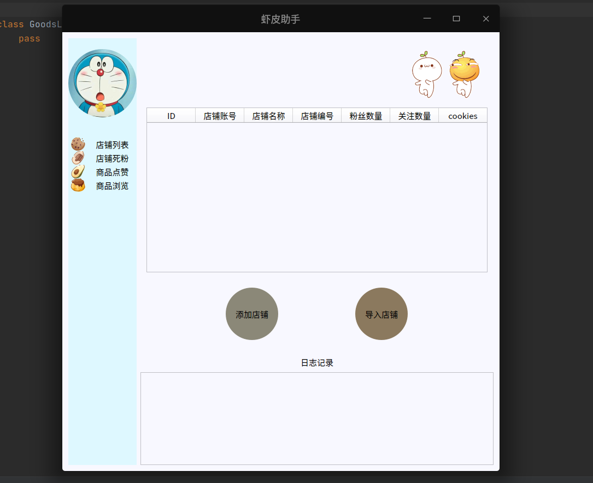

# 虾皮助手

**基于Python3+PyQt5开发的虾皮商城助手，功能如下：**

1. 店铺管理
2. 小号管理
3. 店铺活粉
4. 店铺流量
5. 店铺死粉
6. 商品点赞
7. 排名查询
8. 上热搜词
9. 热词搜集

**使用方法：**

`pip install -r requirements.txt`

`python main.py`

**个人博客:**`https://www.classmatelin.top`

